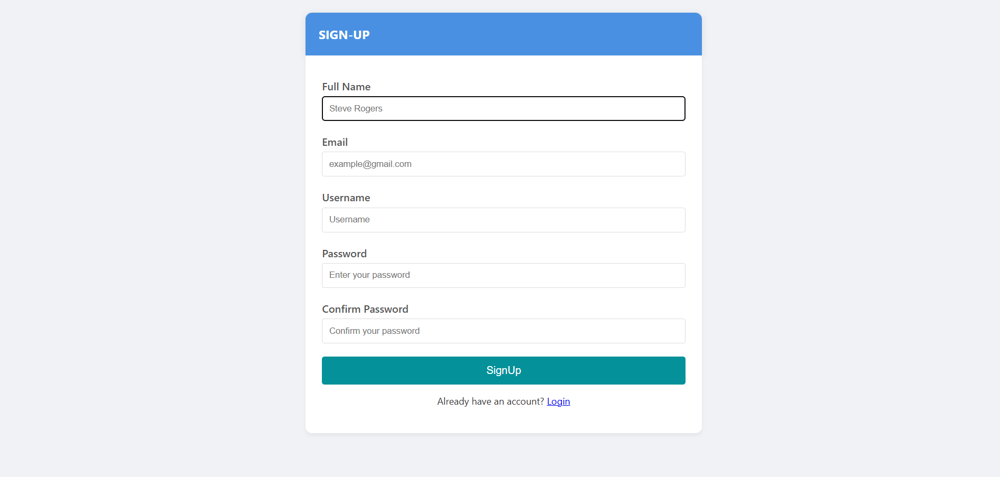
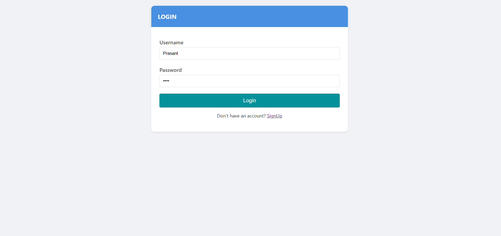
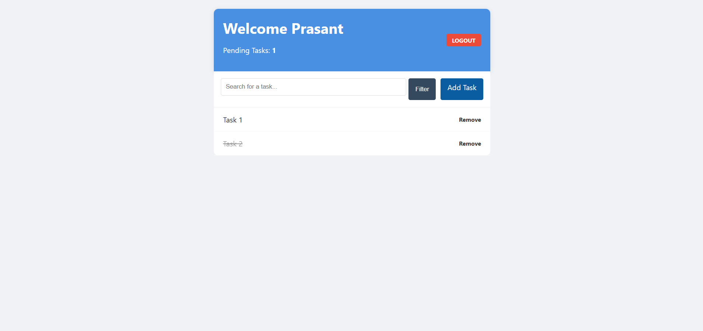

# Title  
**CRUD Web Application with User Authentication**

---

## Objectives  
- Learning Django’s request–response cycle  
- Implementing user authentication (Register, Login, Logout)  
- Performing CRUD (Create, Read, Update, Delete) operations  
- Applying access control using authentication decorators  

---

## Tools & Technologies Used  
- **Backend:** Django (Python)
- **Frontend:** HTML (Django Templates)
- **Database:** SQLite (default Django database)

---

## Output 

### Sign-Up Page

### Login Page

### Home Page

---

## Discussion  
This project provided hands-on experience with Django’s core concepts, including URL routing, view handling, template rendering, and database operations using the Django ORM. Implementing user authentication helped in understanding how Django manages sessions and access control. The CRUD functionality reinforced the flow of data between models, views, and templates, while features like task filtering and user-specific data ensured practical exposure to real-world application logic. Overall, the project served as a focused introduction to building secure and structured web applications using Django.

---

## Conclusion  
The Simple To-Do List application successfully meets its objective of demonstrating Django fundamentals through a practical implementation. By combining authentication with CRUD operations, the project establishes a strong base for future development. This work lays the groundwork for exploring advanced Django features and building more scalable and feature-rich web applications.

---

